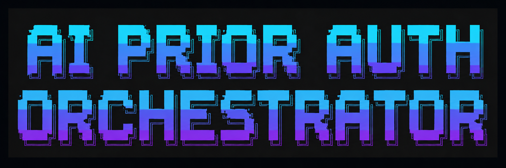

<p align="center">
  <!-- You can upload the banner image to your repo's 'assets' or 'images' folder and update the src below -->
  
</p>
<p align="center">
  <!-- Core Tech Stack -->
  
  
  
  
  
  
  <br/>
  <br/>
  <!-- Agents, MCP, and Frameworks -->
  
  
  
  
  <br/>
  <br/>
  <!-- Repository Info -->
  
</p>

# Multi-Agent Healthcare Clinical Orchestrator


# Multi-Agent Healthcare Clinical Orchestrator

## Overview

This Multi-Agent System is designed to streamline clinical and administrative workflows by routing user questions to specialized AI agents. It seamlessly integrates patient clinical data (EHR) with insurance/payer policies (Prior Authorization) to provide comprehensive, context-aware answers.

The system consists of three main components:
1. **Clinical Orchestrator:** A central routing agent that determines whether to call the EHR Agent, the Payer Agent, or both based on the user's query. It evaluates the combined context and synthesizes the final response.
2. **EHR Agent:** A specialized agent that handles patient clinical data. It enables users to upload a FHIR JSON patient bundle and securely extracts demographics, conditions, medications, lab results, encounters, etc.
3. **Payer Agent:** A specialized agent that interacts with a Pinecone-backed Vector Database (via the PDF MCP Server) to retrieve information on insurance policies, prior authorization criteria, and step therapy rules.

---

## Architecture Components

| Component | Technology |
| :--- | :--- |
| UI | Streamlit |
| Orchestration | OpenAI SDK and MCP SDK |
| Document Parsing | Unstructured |
| Embedding Model | Sentence Transformers (intfloat/e5-base-v2) |
| Vector Database | Pinecone (HNSW) |
| Chunk Retrieval | BM25 + Cosine Similarity |
| Chunk Finalisation Strategy | Reciprocal Rank Fusion (RRF) + Cross-Encoder Based Re-Ranking (ms-marco-MiniLM-L-12-v2) with FlashRank |
| LLM | OpenAI GPT 5.4 mini |

---

## Project Structure

```text
multi_agent_system/
├── orchestrator/
│   └── app.py                  # Main Orchestrator Streamlit App
├── ehr_agent/
│   ├── app.py                  # Standalone EHR Streamlit App
│   ├── agent.py                # EHR Agent Logic
│   └── mcp_server.py           # EHR MCP Server setup
├── payer_agent/
│   ├── app.py                  # Standalone Payer Streamlit App
│   └── agent.py                # Payer Agent Logic
├── pdf_mcp_server/
│   ├── ingest.py               # Script to ingest PDF into Pinecone
│   ├── rag_engine.py           # RAG retrieval logic
│   ├── data_processing.py      # PDF extraction and chunking
│   ├── mcp_server.py           # Payer MCP Server providing context
│   ├── config.py               # Pinecone and OpenAI configurations
├── mcp_client.py               # Shared utility to interact with MCP servers
 ── requirements.txt            # Project Dependencies
└── .env                        # Environment variables (API keys)
```

---

## Setup Instructions

### 1. Prerequisites
- Python 3.10+
- [Pinecone](https://www.pinecone.io/) Account
- OpenAI API Key

### 2. Install Dependencies
Create a virtual environment and install the required dependencies for both the root project and the PDF server:
```bash
python -m venv venv
source venv/bin/activate  # On Windows: venv\Scripts\activate

# Install main requirements
pip install -r requirements.txt

```

### 3. Pinecone Index Setup
The Payer Agent uses a Pinecone Vector Database to search through policy documents. You must set this up before running the ingestion:
1. Log in to your Pinecone console.
2. Create a new Index.
3. **Configuration Details:**
   - **Name:** e.g., `pdf-mcp-db` (You can choose any name, but make sure it matches your `.env`).
   - **Dimensions:** `768` *(Crucial: The system uses the `intfloat/e5-base-v2` embedding model, which outputs exactly 768 dimensions).*
   - **Metric:** `cosine`
4. Retrieve your **Pinecone API Key**.

### 4. Environment Variables
Create or update the `.env` file in the root directory (`multi_agent_system/.env`) with your credentials:
```env
OPENAI_API_KEY="your-openai-api-key"
PINECONE_API_KEY="your-pinecone-api-key"
PINECONE_INDEX_NAME="pdf-mcp-db"  # Match the index name you created in Pinecone
```

### 5. PDF Upload and Vector DB Ingestion
Before the Payer Agent can answer questions, you need to ingest your PDF policy document into Pinecone.

1. Ensure your PDF document (e.g., `Prior Authorization Documentation Guide.pdf`) is placed inside the `pdf_mcp_server/` directory.
2. *(Optional)* If your PDF has a different filename, update the `PDF_FILE_PATH` constant inside `pdf_mcp_server/config.py`.
3. Run the ingestion script:
```bash
cd pdf_mcp_server
python ingest.py
```
**What happens during ingestion?**
- The script partitions the PDF into chunks, extracting text, tables, and images.
- It generates embeddings using HuggingFace (`intfloat/e5-base-v2`).
- It uploads these vectors into your Pinecone Index under a hardcoded namespace: `single-pdf-mcp`.
- It saves a local fallback file (`local_store.pkl`).

*(Note: Depending on the size of the PDF and whether it contains complex tables/images, this process might take a few minutes).*

---

## Running the Application

You can run the full orchestrator or launch the agents individually via Streamlit.

### Run the Full Orchestrator (Recommended)
From the root `multi_agent_system` directory:
```bash
streamlit run orchestrator/app.py
```
This UI provides a unified chat interface, allowing you to upload a patient FHIR bundle and ask combined clinical/policy questions.

### Run Individual Agents
If you wish to test the agents in isolation:
- **EHR Agent:** `streamlit run ehr_agent/app.py`
- **Payer Agent:** `streamlit run payer_agent/app.py`

---

## Usage Guide
1. **Start the Orchestrator App.**
2. **Upload a Patient Bundle:** Use the sidebar file uploader to load a FHIR JSON bundle. This establishes the context for the EHR Agent.
3. **Ask Queries:**
   - **Clinical Questions:** *"What are the patient's active conditions and medications?"* (Routes to EHR Agent)
   - **Policy Questions:** *"What is the step therapy criteria for diabetes?"* (Routes to Payer Agent)
   - **Combined Questions:** *"Does the patient meet the prior authorization criteria for their newly prescribed diabetes medication?"* (The Orchestrator fetches patient history via the EHR agent and evaluates it against the retrieved policy guidelines from the Payer agent).
